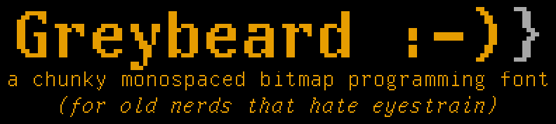
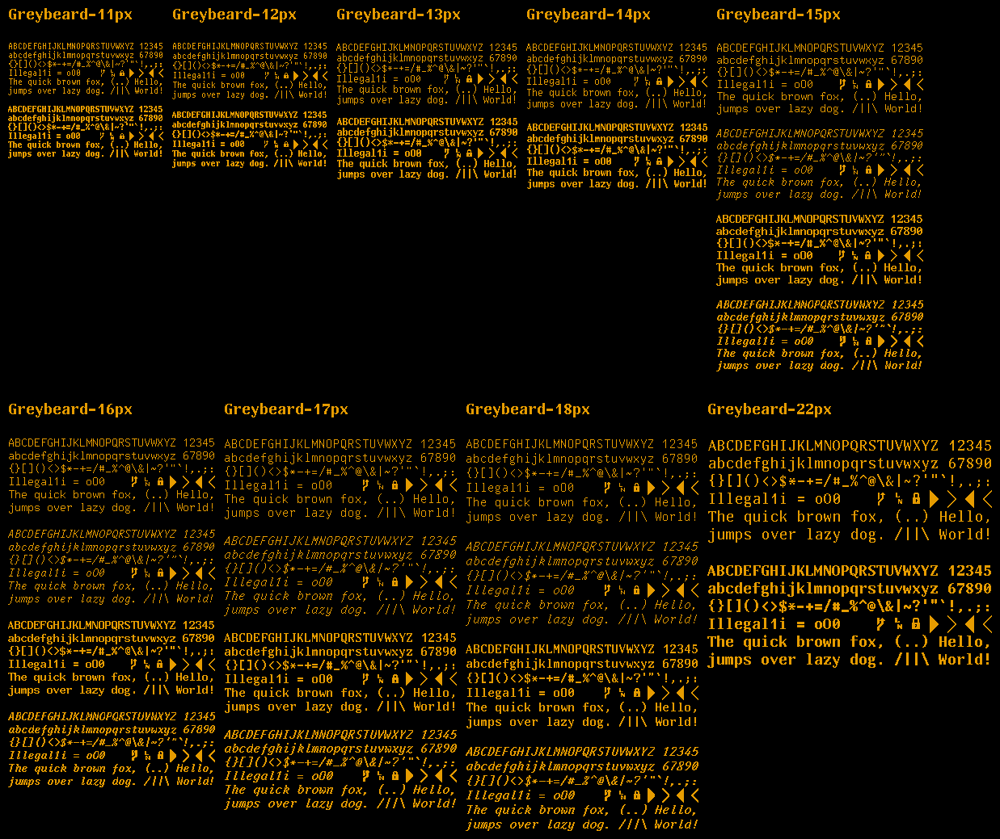

Greybeard is a chunky monospaced bitmap programming font for all you pixel-perfect nerds who don't like eyestrain. It's mostly a vector port of [UW ttyp0](http://people.mpi-inf.mpg.de/~uwe/misc/uw-ttyp0/) with a few tweaks.

It covers most of the Latin and Cyrillic alphabet, Greek, Armenian, Georgian (only Mkhedruli), Hebrew (without cantillation marks), Thai, most of IPA (but no UPA), standard punctuation, common symbols, some mathematics, line graphics and a few dingbats (about 3000 Unicode characters).

It is provided as rendered outline fonts in the following pixel sizes: 11, 12, 13, 14, 15, 16, 17, 18 and 22. Each of these has a bold variant, and italic variants are provided in 15, 16, 17 and 18. Additionally, all fonts with an italic variant have an *experimental* auto-generated bold-italic variant, though mileage with these may vary.

It is named after those mythical sysops, staring at white on blue Borland compilers late into the night. Some say they stare still...

# Samples

# Installation

Font files can be downloaded from the [releases page](https://github.com/flowchartsman/greybeard/releases)

# Usage

Greybeard is split into multiple separate fonts named with the point size they are intended to be rendered at for pixel-perfect display. To use it, install the variant you like, and then set the font size of your editor or terminal to match. For example, if you like the 18px size, install `Greybeard-18px*.ttf` and set the size to `18pt` in your application. Because of the way the outlines are generated, multiples should work as well.

For code editors you may need to set an explicit line height as well, to keep the spacing sane. For example, setting the line height to around `1` in VSCode seems to work well.

The reason the font is split up into different sizes is because Windows [kind of a jerk](http://www.electronicdissonance.com/2010/01/raster-fonts-in-visual-studio-2010.html) about bitmap fonts. In theory, .ttf *does* support embedding bitmap versions of various point sizes (a feature called bitmap strikes), but Windows has decided to ignore this except in [very specific, fiddly cases](https://int10h.org/blog/2016/01/windows-cleartype-truetype-fonts-embedded-bitmaps/)), which have the side effect of making the font useless in the terminal. This is unacceptable for this font, so here we are. If you know of way around this limitation, please comment in the [ongoing issue](https://github.com/flowchartsman/greybeard/issues/9) and maybe send a PR my way.

# Relation to UW ttyp0

Most of the work towards Greybeard has been in assembling a toolkit to convert the original bitmap font, [UW ttyp0](https://people.mpi-inf.mpg.de/~uwe/misc/uw-ttyp0/), to a modern outline format and trying to make sure it renders crisply. The actual glyphs are still almost entirely the work of Uwe Waldmann, the original creator of UW ttyp0. There have been a few tweaks, and will likely be a few more as the project progresses, but we wouldn't have such a comprehensive bitmap font without all of Uwe's hard work. The reason it has a different name is pretty simple: the MIT Licence that UW ttyp0 uses stipulates an additional clause that any changes that add or alter glyphs should cause the font to be renamed in such a way to dissasociate it from the original author. This makes sense, since no one wants to get spammed with support requests or complaints for something they didn't write. By giving it a completely different name, I hope to avoid this. Also "Greybeard" is a fun name. So, yeah. Any issues should target this project.

The following is a brief list of differences from UW ttyp0:

- Render nbsp as normal space to avoid rendering glyphs in editor whitespace.
- Default to straight apostrophe/graves.
- Default to slashed zero.
- Default to centered tilde.
- Fixed `#` glyph for certain sizes/weights to make it less "pointy".
- Bold-Italic variants.
- Additional height properties to help .ttf generation.

# Building

If you want to build the font yourself for testing or if you want to select stylistic variants, you can use the dockerized build process which uses the [bitmap-font-vector-build](https://hub.docker.com/r/flowchartsman/bitmap-font-vector-build) container I created to collect all of the necessary tools in one place. Just make whatever changes you like and run `./scripts/docker_build.sh`, which will generate .ttf files in `font_out`. You can also specify any make target you like with this script. The ones that probably interest you are:

- `ttfs`
- `woff2s`
- `pcfs`

Note: the `woff2s` target will also generate the .ttf files, since it creates the .woff2 files from them.

Mostly you will probably only want to modify `build/VARIANTS.dat` and rebuild the font.

# Repo Layout
The tree under `/build` is more or less the same layout as the original repo, and is used to build the intermediate .bdf files which then generate both the .ttf and .pcf files. The intermediate .bdf files are in turn created by applying the settings in `build/VARIANTS.dat` to the files in `build/bdf`, which serve as the source of truth for the font.

Manual instructions in `build/INSTALL` are kept around for legacy purposes and are geared towards generating and installing a gzipped pcf font, so they are probably not useful to anyone these days. If you're installing the font in an environment that supports it, you probably know what you're doing.

# Reporting Issues
Most testing is done on MacOS, so there aren't a lot of eyes on Windows and Linux. Please file an issue if you have problems with usage and/or rendering on any platform.
