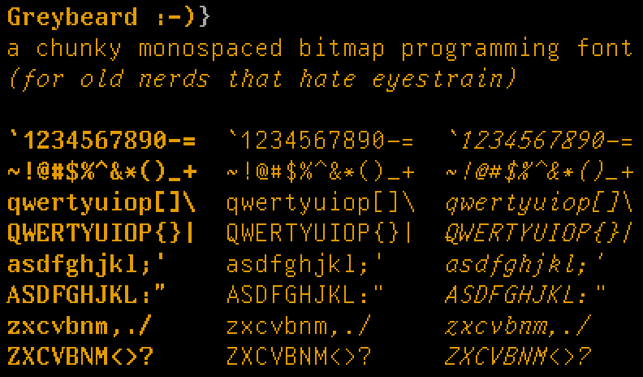
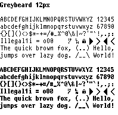
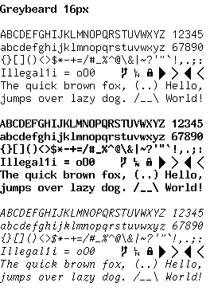
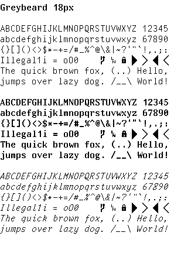
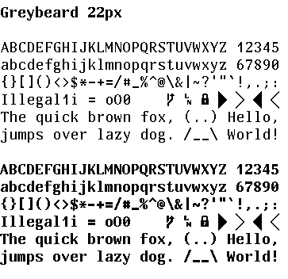

Greybeard is a chunky monospaced bitmap programming font for all you pixel-perfect nerds who don't like eyestrain. It's based off of [UW ttyp0](http://people.mpi-inf.mpg.de/~uwe/misc/uw-ttyp0/).

It covers most of the Latin and Cyrillic alphabet, Greek, Armenian, Georgian (only Mkhedruli), Hebrew (without cantillation marks), Thai, most of IPA (but no UPA), standard punctuation, common symbols, some mathematics, line graphics and a few dingbats (about 3000 Unicode characters).

~~It has bitmap strikes~~ It is provided as rendered outline fonts in the following pixel sizes: 11, 12, 13, 14, 15, 16, 17, 18 and 22. Each of these has a bold variant, and italic variants are provided in 15, 16, 17 and 18.

It is named after those mythical sysops, staring at white on blue Borland compilers late into the night. Some say they stare still...

# Installation

You can use the provided fonts in the font-files/ttf directory.

# Screenshots

# Update - 03-08-2022

Until such time as a reasonable, automated process for building a unified ttf with bitmap strikes is found, I've switched to [Bits'N'Picas](https://github.com/kreativekorp/bitsnpicas) for generating synthetic outlines. This appear to work well in MacOS testing. Unfortunately, this means that each size is now a separate family, but this at least has the side benefit of making it very clear what the intended rendering size is for the maximum crispness.

Manual instructions in build/INSTALL are slightly out of date, since the .bfs in font-files represent the current source of truth. I will be working to update the installation process on this, so stay tuned.

Please file an issue for any problems with usage or rendering on other platforms.
