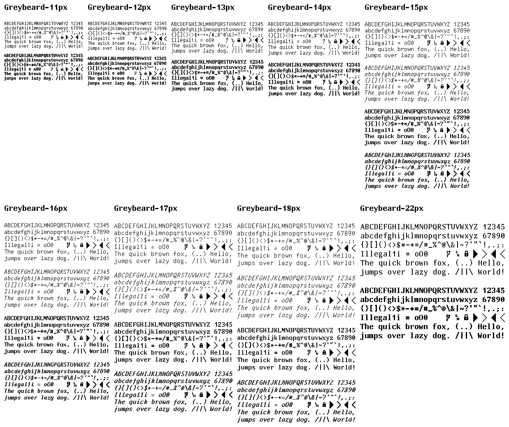

Greybeard is a chunky monospaced bitmap programming font for all you pixel-perfect nerds who don't like eyestrain. It's mostly a port of [UW ttyp0](http://people.mpi-inf.mpg.de/~uwe/misc/uw-ttyp0/) with a few tweaks.

It covers most of the Latin and Cyrillic alphabet, Greek, Armenian, Georgian (only Mkhedruli), Hebrew (without cantillation marks), Thai, most of IPA (but no UPA), standard punctuation, common symbols, some mathematics, line graphics and a few dingbats (about 3000 Unicode characters).

It is provided as rendered outline fonts in the following pixel sizes: 11, 12, 13, 14, 15, 16, 17, 18 and 22. Each of these has a bold variant, and italic variants are provided in 15, 16, 17 and 18. Additionally, all fonts with an italic variant have an *experimental* auto-generated bold-italic variant, though mileage with these may vary.

It is named after those mythical sysops, staring at white on blue Borland compilers late into the night. Some say they stare still...

# Installation

You can use the provided fonts in the `dist/` directory.

# Samples

# Changes from UW ttyp0

- Default to straight apostrophe/graves.
- Default to slashed zero.
- Default to centered tilde.
- Render nbsp as normal space to avoid editor issues.
- Fixed `#` glyph for certain sizes/weights to make it less "pointy".
- Bold-Italic variants.
- Additional height properties to help .ttf generation.

The files in `/build` are more or less the same layout as UW ttyp0, and are used to build the intermediate .bdf files with variants applied from the templates which serve as the source of truth for the font.

Manual instructions in `build/INSTALL` are geared towards installing a .pcf font and are probably not useful to anyone these days, but you can probably figure it out if that's what you want. Alternatively, you can file an issue and I can resurrect the .pcf generation as part of release.

Most testing is done on MacOS, so there aren't a lot of eyes on Windows and Linux. Please file an issue if you have problems with usage and/or rendering on any platform.
